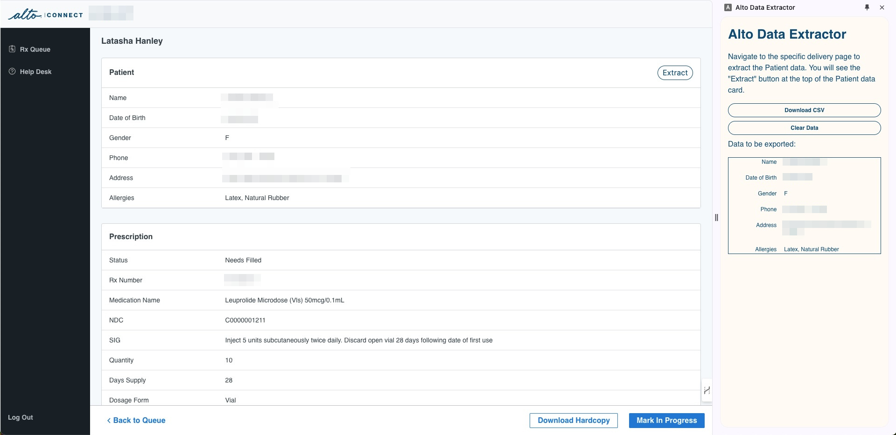

# Alto Data Exporter

Alto-Export is a browser extension designed to streamline the process of extracting patient data from Alto Pharmacy for Providers so they can import it into their Compounding Software like `PK Compounding Software`.

## Screenshot

## Installing this extension

1. Download the code using the `Download ZIP` option on Github. Extract all the files on your local computer.
2. Load this directory in Chrome as an [unpacked extension](https://developer.chrome.com/docs/extensions/mv3/getstarted/development-basics/#load-unpacked).
3. [Pin](https://developer.chrome.com/docs/extensions/mv3/getstarted/development-basics/#pin) the extension.
4. Go to https://alto.com and login as a provier.
5. Click on the `A` icon to open the side panel.

You can also open the side panel by pressing `Ctrl+B` (Windows) or `Cmd+B` (macOS).
